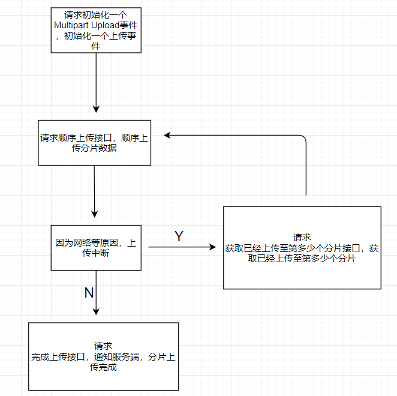

# 设计
## 流程

* 接收最后1个分片时，会将所有分片文件合并成1个文件

## 接口

### 初始化一个Multipart Upload事件(v1/multipart/parallel/uploadInit)
* 输入

| 名称 | 字段 | 类型 | 必须 | 说明 |
| - | - | - | - | - |
| 资源名 | resourceKey | string | Y | 包含文件名后缀 |

* 输出

| 名称 | 字段 | 类型 | 必须 | 说明 |
| - | - | - | - | - |
| 上传id| uploadId | string | Y |  |
| 资源名之前是否存在| isExist | boolean |  |  |


### 分片上传数据(v1/multipart/parallel/upload)
* formdata上传方式

* 输入

| 名称 | 字段 | 类型 | 必须 | 说明 |
| - | - | - | - | - |
| 分片值 | partNumber | int | Y | 0-10000范围内的值 |
| 上传id | uploadId | string | Y |  |
| 文件分片内容 | content | binary | Y | 推荐大小范围1MB-100MB |
| 文件分片的MD5值 | md5 | string | Y | 即md5值 |

* 输出

| 名称 | 字段 | 类型 | 必须 | 说明 |
| - | - | - | - | - |
| 文件分片的MD5值| md5 | string |  |  |

### 完成上传 (v1/multipart/parallel/uploadComplete)

* 输入

| 名称 | 字段1 | 字段2 |类型 | 必须 | 说明 |
| - | - | - | - | - | -- |
| 分片结果集 | completeMultipartUpload |  | array |y  | |
| 分片值 |  | partNumber | int | y  | |
| 文件分片的MD5值 |  | md5 | string |y  | |
| 上传id | uploadId |  | string |y  | |

* 输入参考

```
{
  "completeMultipartUpload": [
    {
      "partNumber": "1",
      "md5": "sfancdkfn"
    },
    {
      "partNumber": "2",
      "md5": "wrebibvkio"
    }
  ],
  "uploadId":"1111"
}
```

### 获取已经上传的分片(v1/multipart/parallel/listParts)
* 输入

| 名称 | 字段 | 类型 | 必须 | 说明 |
| - | - | - | - | - |
| 上传id | uploadId |  | string |y  | |

* 输出

| 名称 | 字段 | 类型 | 必须 | 说明 |
| - | - | - | - | - |
| 分片值 | partNumber | int | y  | |
| 文件分片的MD5值 | md5 | string |y  | |

## 阿里云OSS
* [阿里云OSS](https://help.aliyun.com/document_detail/31991.html)

| 接口 | 输入 | 输出 |
| - | - | - |
| [InitiateMultipartUpload](https://help.aliyun.com/document_detail/31992.html) | key：downloadKey <br> md5：md5 | uploadId：上传id |
| [UploadPart](https://help.aliyun.com/document_detail/31993.html) | partNumber=2 <br> uploadId=0004B9895DBBB6EC98E36 | ETag 也就是part的md5值 |
| [CompleteMultipartUpload](https://help.aliyun.com/document_detail/31995.html) | uploadId <br> PartNumber <br> ETag |  |
| [ListParts](https://help.aliyun.com/document_detail/31998.html) |  |  |

### InitiateMultipartUpload
1. 使用Multipart Upload模式传输数据前，必须先调用该接口来通知OSS初始化一个Multipart Upload事件。
1. 说明
    1. 该接口会返回一个OSS服务器创建的全局唯一的Upload ID，用于标识本次Multipart Upload事件。您可以根据这个ID来发起相关的操作，如中止Multipart Upload、查询Multipart Upload等。
    1. 初始化Multipart Upload请求，并不会影响已存在的同名Object。 ？ （如果同名了，告诉客户端已经存在了，但是依旧返回uploadId，如果客户端继续上传，则会把原来的文件覆盖掉，相当于把是否覆盖的逻辑交给客户端负责）

### UploadPart
1. 初始化一个MultipartUpload之后，可以根据uploadId来分块（Part）上传数据。
1. 说明
    1. 调用该接口上传Part数据前，必须先调用InitiateMultipartUpload接口来获取一个OSS服务器颁发的Upload ID。Upload ID用于唯一标识上传的part属于哪个Object。
    1. 每一个上传的Part都有一个标识它的号码（part number，范围是1-10000），单个Part大小范围100KB-100MB。MultipartUpload要求除最后一个Part以外，其他的Part大小都要大于等于100KB。因不确定是否为最后一个Part，UploadPart接口并不会立即校验上传Part的大小，只有当CompleteMultipartUpload的时候才会校验。
    1. 如果你用同一个part number上传了新的数据，那么OSS上已有的这个号码的Part数据将被覆盖。
    1. OSS会将服务器端收到Part数据的MD5值放在响应结果里返回给用户。

### CompleteMultipartUpload
1. 在将所有数据Part都上传完成后，必须调用CompleteMultipartUpload接口来完成整个文件的MultipartUpload。
1. 在执行该操作时，用户必须提供所有有效的数据的Part列表（包括Part值和MD5）。OSS收到用户提交的Part列表后，会逐一验证每个数据Part的有效性。当所有的数据Part验证通过后，OSS将把这些数据part组合成一个完整的Object。
1. 说明
    1. CompleteMultipartUpload时会确认除最后一块以外所有块的大小是否都大于100KB，并检查用户提交的Part列表中的每一个Part号码和Etag。所以在上传Part时，客户端除了需要记录Part号码外，还需要记录每次上传Part成功后服务器返回的MD5值。
    1. 由于OSS处理CompleteMultipartUpload请求时会持续一定的时间。在这段时间内，如果客户端与OSS之间连接中断，OSS仍会继续将该请求。
    1. 用户提交的Part列表中，Part号码可以不连续。例如第一块的Part号码是1，第二块的Part号码是5。
    1. OSS处理CompleteMultipartUpload请求成功后，该Upload ID就会变成无效。
    1. 同一个Object可以同时拥有不同的Upload ID，当Complete一个Upload ID后，该Object的其他Upload ID不受影响。

### ListParts
1. ListParts接口用于列举指定Upload ID所属的所有已经上传成功Part。
1. 说明
    1. OSS的返回结果按照Part号码升序排列。

## 参考
* [前端接入实例](https://blog.csdn.net/haohao123nana/article/details/54692669)
