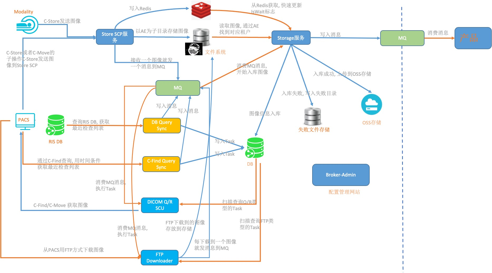

# 设计
## 流程

## 组件
### Broker-StoreScp: Dicom C-Store SCP
1. 接收DICOM图像, 按AE为子目录存储图像
1. 每接收一个图像, 就往MQ写入消息, 同时更新Redis下该检查下的图像数量
1. 当DICOM连接关闭时, 更新在该连接中接收的所有检查的关闭标志

### Broker-Storage: Dicom图像入库服务
1. 根据MQ的消息, 获取对应的图像的存储目录, 解析图像, 开始插入检查/序列/图像信息到数据库, 然后上传图像文件到OSS; 如果入库失败, 则把图像移动到失败文件目录;
1. 一个单独线程间隔一定时间扫描失败文件目录, 如果失败图像文件没超过过期时间, 则移动到存储目录, 同时再插入一个消息到MQ; 如果失败文件超期, 则直接删除.
1. 定时任务根据检查的最后更新时间来修改IsWait标志
1. 定时任务来根据Redis的信息来修改检查的IsWait标志
1. 定时任务发送已经接收完成的检查到MQ, 让锐影处理检查

### Broker-Service:
1. Broker-Admin: 提供Web配置管理.
1. Broker-DBQuerySync: 轮询查询RIS数据库, 获取最近的StudyList, 如果Study在DB不存在, 则生成Task插入到数据库, 同时往MQ插入消息
1. Broker-CFindQuerySync: 用时间条件通过C-Find来查询PACS的Query/Retrieve服务,获取最近的StudyList, 如果Study在DB不存在, 则生成Task插入到数据库, 同时往MQ插入消息
1. Broker-QRScu: 读取MQ消息, 执行Task, 通过PACS的Query/Retrieve服务来Move图像到Dicom C-Store SCP. 同时通过扫描数据库的Task表中的QR类型的Task, 来重试失败的Task
1. Broker-FTP: 读取MQ消息, 执行Task, 通过FTP从PACS下载图像到本地的存储目录, 然后写入MQ通知Storage来入库图像.同时通过扫描数据库的Task表中的FTP类型的Task, 来重试失败的Task
